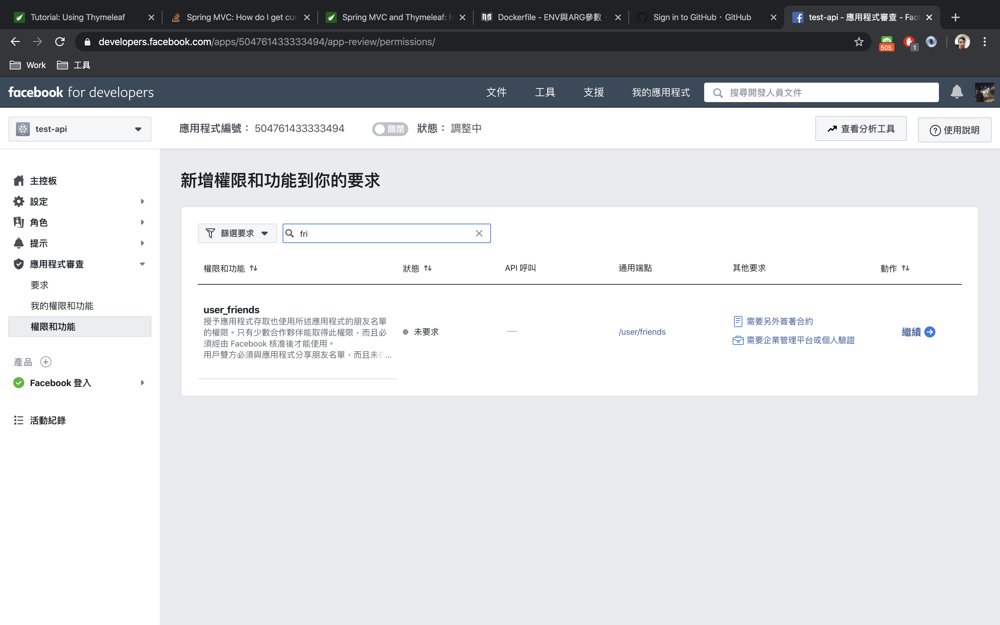

### 設定
 請將 application.yml 中的 `facebook.app-id` 和 `facebook.app-secret` 進行修改，或透過環境變數 `FACEBOOK_APP_ID`, `FACEBOOK_APP_SECRET` 來進行設定。

### 臉書授權
 某些的授權請求，是需要先經過申請的。
 
### Docker
    docker-compose up --build

### 參考
 - [HTTPS 設定](https://www.tutorialspoint.com/spring_boot/spring_boot_enabling_https.htm)